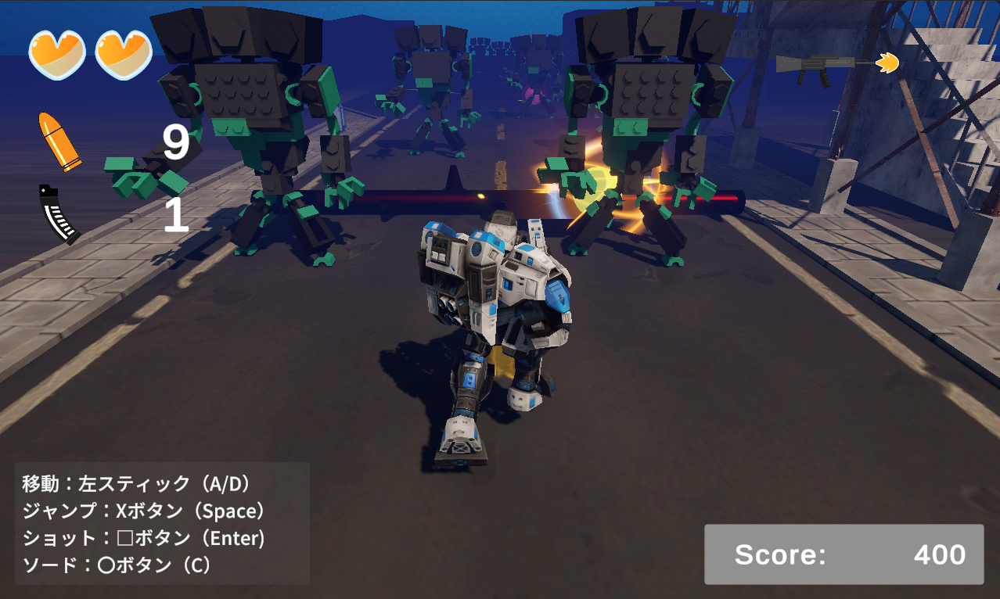

# RunAndGunSurvivor

## プログラムの場所
* Assets/Scriptsフォルダ・・・各スクリプト

## 1. 作品概要
本作は、前方への自動移動を行いながら迫りくる敵を撃破し、ギミックを攻略していく3Dランアクション・シューティングゲームです。
Unity 6（6000.3.5f2）の新機能を活用し、視覚的なクオリティとリプレイ性の両立を目指して制作しました。

* **ゲームプレイページ**: <a href="https://limit-sy.github.io/runandgunsurvivor_gameplay/" target="_blank">[こちらからプレイできます]</a>
* **リポジトリ**: <a href="https://github.com/limit-sy/RunAndGunSurvivor" target="_blank">[GitHub - RunAndGunSurvivor]</a>
* **制作期間**: 2026年3月3日 ～ 2026年3月27日

## 2. 開発の背景と目的
2Dゲーム制作の基礎を終え、ステップアップとして初の本格的な3Dゲーム制作に挑戦しました。
「3Dならではの空間演出」と「動的なゲーム設計」を学習テーマとして設定しています。

* **空間演出**: Directional Lightによるライティング調整や、Cinemachine Cameraを用いた臨場感のあるカメラワークを追求しました。
* **ゲーム設計**: 短い制作期間の中で面白さを最大化するため、操作をシンプルにしつつ、ステージやギミックをランダム生成にすることで、プレイするたびに異なる体験ができるよう工夫しました。

## 3. 使用技術・ツール
* **開発環境**: Unity 6 (6000.3.5f2)
* **言語**: C# (Visual Studio Community 2026)
* **バージョン管理**: Sourcetree / Git
* **使用アセット**: 
    * Fantasy SkyBox FREE（環境演出）
    * Russian buildings lowpoly pack（ステージ造形）
    * Free Quick Effects Vol.1 / SlashEffects FREE（VFX）
* **参考書籍**: Unity2021 3D/2Dゲーム開発実践入門 (ソシム)

## 4. 技術的な実装のポイント
### ① ステージ・ギミックのランダム生成
飽きを防ぐため、ステージのセグメントや配置されるギミックを毎回ランダムに生成するロジックを実装しました。これにより、限られたアセット数でも多様なコースパターンを実現しています。

### ② Cinemachineによるカメラ演出
Cinemachine Cameraを活用し、プレイヤーの動きに合わせた滑らかでダイナミックな追従を実現。3Dならではの奥行き感とスピード感を強調しています。

### ③ メンテナビリティを意識したコード構成
前職（インフラ・システム開発）の経験を活かし、スクリプトの役割を明確に分ける（疎結合）ことを意識しました。
* `Assets/Scripts`: 各オブジェクトの振る舞い、ゲームマネージャー、生成ロジックを整理して格納。

## 5. 作品の遊び方
| アクション | キーボード | ゲームパッド |
| :--- | :--- | :--- |
| **移動** | `A` / `S` / `矢印キー` | 左スティック |
| **ジャンプ** | `Space` | Southボタン |
| **ショット** | `Enter` | Westボタン |
| **ソード** | `C` | Eastボタン |
| **決定** | `Enter` | Eastボタン |

## 6. 今後の課題
* **バリエーションの追加**: 敵の種類や攻撃パターンの多様化。
* **UI/UXのブラッシュアップ**: 3D空間に馴染むスタイリッシュなHUDの実装。
* **パフォーマンス最適化**: 大量オブジェクト生成時の負荷軽減。

## 7. 所感
初の3D作品として、ライティングやカメラワークによる「見た目の変化」を楽しみながら制作できました。今後はさらに複雑なゲームロジックの実装にも挑戦していきたいと考えています。